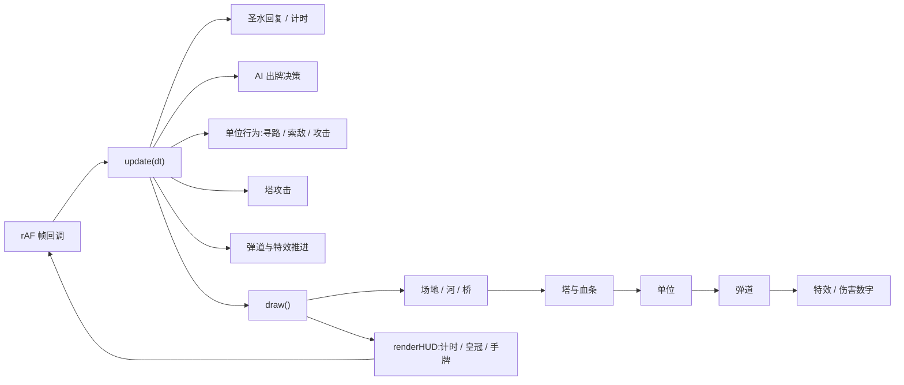

# ⚔️ Clash Royal · 简化版皇室战争 —— 项目文档

> Game Hackathon 团队项目 · 独立项目文档(Standalone Project Document)
> 仓库:<https://github.com/AlghaPorthos/clash_royal>

| 项目基本信息 | |
|---|---|
| 项目名称 | Clash Royal · 简化版皇室战争 |
| 项目类型 | 网页即时策略卡牌对战游戏(单人 vs AI) |
| 技术栈 | HTML5 Canvas + 原生 JavaScript + CSS,零依赖 |
| 文件结构 | `index.html`(落地页)· `game.html`(对战)· `assets/`(美术素材) |
| 运行方式 | 浏览器直接打开,无需安装与构建 |
| 在线体验 | **[🌐 落地页 Landing Page](https://alghaporthos.github.io/clash_royal/)** · [⚔️ 对战页 Battle](https://alghaporthos.github.io/clash_royal/game.html)(GitHub Pages) |
| 当前状态 | 已可完整游玩:8 卡池、圣水系统、双路过桥寻路、AI 对战、3 分钟计时、双语界面 |

---

## 1. 项目概览

本项目是皇室战争(Clash Royale)的简化复刻:玩家与 AI 各守半场,消耗圣水部署卡牌单位,单位自动寻路、索敌、攻击,摧毁对方**国王塔**即获胜。项目在 3 天的 Hackathon 周期内完成从零到可玩的全流程,坚持"单文件、零依赖、即开即玩"的工程约束,所有游戏逻辑与视觉表现(弹道、刀光、粒子、爆炸过场)均由原生 Canvas 与 JavaScript 手写实现。

### 1.1 设计目标

- **可玩性优先**:在简化卡池(固定 8 张)的前提下保留原作核心循环——攒圣水 → 出牌 → 对战 → 夺冠;
- **表现力**:战斗过程全可视化,弹道曳光、近战刀光、伤害数字、受击闪白、爆炸粒子均可见;
- **工程克制**:不引入任何框架与构建工具,双击 HTML 即可运行,便于评审与传播;
- **双语友好**:落地页与游戏页全量中英双语,一键切换。

---

## 2. 团队与分工

| 成员 | 职责 | 主要产出 |
|---|---|---|
| **AlghaPorthos**(Porthos Gaa-Lok Fu) | 项目发起 · 核心引擎 · 视觉表现 | 战场引擎(地形/寻路/索敌/圣水/计时)、战斗特效、落地页、点击开始爆炸过场、官方素材接入、游戏页双语、仓库与 PR 管理(合并 #4–#6) |
| **JennyYang58** | 文档 · 前端导航 · 国际化 | 初始 README、README 扩写(About / Contributing)、落地页 hero 导航菜单与中英 i18n |
| **Juviamai** | 文档协作 | README「Juvia Readme」章节(PR #6) |

协作方式:功能分支 + Pull Request 评审合入(见 §8 开发历程),main 分支始终保持可发布状态。

---

## 3. 游戏设计

### 3.1 核心规则

- **对局时长** 3 分钟(倒计时),最后 1 分钟圣水回复速度 ×2;
- **圣水(Elixir)** 每 2.8 秒回复 1 点,上限 10,是出牌的唯一资源;
- **手牌** 固定 8 张卡池随机发 4 张,出一张补一张,并随时预览"下一张";
- **部署限制** 部队/建筑只能部署在自己半场,火球法术全场可放;
- **胜负判定** 摧毁国王塔立即获胜;超时则依次比较皇冠数 → 塔剩余血量总和;
- **塔体系** 每方 1 座国王塔 + 2 座公主塔;公主塔被毁后国王塔**激怒**(射程 135→160,伤害提升),与原作一致。

### 3.2 固定卡池(8 张)

| 卡牌 | 费用 | 血量 | 伤害 | 攻速 | 定位 |
|---|---|---|---|---|---|
| 💀 骷髅 ×3 | 2 | 60 | 55 | 1.0s | 人海拉扯 |
| 🗡️ 骑士 | 3 | 600 | 75 | 1.2s | 均衡近战 |
| 🏹 弓箭手 ×2 | 3 | 125 | 40 | 1.2s | 廉价远程 |
| 🏰 加农炮 | 3 | 380 | 80 | 1.4s | 防守建筑,25s 衰减消失 |
| ⚔️ 迷你皮卡 | 4 | 550 | 290 | 1.8s | 单体爆发 |
| 🔫 火枪手 | 4 | 300 | 80 | 1.1s | 长射程后排 |
| 🔥 火球 | 4 | — | 300(对塔 40%) | — | 范围法术 |
| 🗿 巨人 | 5 | 1800 | 110 | 1.5s | 只攻击建筑与塔的肉盾 |

### 3.3 地形与寻路

战场为 480×800 的 Canvas,横向中央为河流,左右两座桥(约 22% / 78% 宽度处)是仅有的过河通道。地面单位未过河时自动**就近选桥**行进,过河后直线扑向目标;飞行弹道不受地形限制。

---

## 4. 功能特性清单

**核心玩法**
- 圣水自动回复 + 最后 1 分钟双倍圣水
- 4 张循环手牌 + 下一张预览
- 单位自动寻路(双路过桥)、索敌、近战/远程攻击
- 巨人专属索敌逻辑(只打塔与建筑,无视小兵)
- 加农炮建筑持续掉血、25 秒到期消失
- 公主塔被毁 → 国王塔激怒
- 3 分钟计时、皇冠计分、超时比塔血判定

**表现力**
- 箭矢曳光 / 火枪弹道 / 加农炮弹 三种可见弹道
- 近战单位攻击突刺 + 刀光弧线,受击闪白
- 实时飘出伤害数字;单位/塔死亡爆炸粒子
- 火球从天而降并带火焰尾迹,落点爆炸 + 冲击波
- 点击"开始对战"的**皇室战争式爆炸过场**:双王冠相向冲锋 → 撞击白闪 + 震屏 + 三层冲击波 + 约 200 个火花粒子 → "开始对战!"弹性砸入 → 自动进入对战(约 2.15s,点击可跳过,并尊重系统"减少动态效果"设置)

**UI / UX**
- 落地页:英雄区、导航菜单(对战/图鉴/玩法/语言)、卡池图鉴、四步玩法引导、特性介绍、CTA
- 全部单位/塔/弹体采用 **Supercell Fankit 官方立绘**(1024px PNG,替代早期 emoji 方案),覆盖手牌、下一张预览、属性面板、战场单位与塔
- 卡牌悬浮属性提示(血量/伤害/攻速/射程/速度/特性)
- 圣水充能可视化:卡牌随圣水从黑白渐变为彩色 + 底部充能进度条
- 全量中英双语(落地页与游戏页共享语言偏好,localStorage 持久化)
- 响应式布局,手机浏览器可玩,点击即部署

---

## 5. 技术架构

### 5.1 总体结构

```
clash_royal/
├── index.html   # 落地页(介绍 + 图鉴 + 玩法 + 爆炸过场)
├── game.html    # 对战页(引擎 + HUD 全部内联,单文件)
├── assets/      # Supercell Fankit 官方立绘(15 张 1024px PNG)+ 素材说明
├── PROJECT.md   # 本文档
└── README.md    # 仓库说明
```

### 5.2 游戏主循环

对战页采用经典的 **update → draw** 双阶段循环,以 `requestAnimationFrame` 驱动,帧间隔换算为秒并截断(≤50ms)以避免切后台后时间跳跃:



### 5.3 模块划分(单文件内按注释分区)

| 模块 | 职责 |
|---|---|
| 卡牌定义 `CARDS/DECK` | 8 张卡的数值与类型(部队/建筑/法术) |
| 状态 `units/shots/fx/towers` | 单位、弹道、特效、塔四大数据容器 |
| 部署 `deploy()` | 按卡牌类型生成单位/法术弹道,维护手牌循环 |
| AI `aiThink()` | 敌方出牌决策(见 §6.2) |
| 行为 `findTarget/moveToward` | 索敌优先级与桥路寻路 |
| 战斗结算 `hit/boom` | 伤害、皇冠结算、塔激怒、爆炸粒子 |
| 渲染 `draw()` | 分层绘制场地→塔→单位→弹道→特效→圣水条→遮罩 |
| 国际化 `L/T/applyLang` | 中英文案字典与 DOM 同步 |

落地页独立维护自身的 i18n 字典、卡池/步骤/特性渲染,以及爆炸过场动画(独立 Canvas 实例 + rAF 循环,与业务页面解耦)。

---

## 6. 核心系统实现要点

### 6.1 索敌与寻路

- 索敌优先级:普通单位先在半径 170 内找最近敌方部队,找不到再转向最近建筑/塔;巨人跳过部队直接锁定建筑;
- 寻路:未过河单位计算距两桥的横向距离,先走到最近桥的桥头,再沿桥过河,过河后直线追击目标;河道区域判定 `inRiver` 保证单位不会涉水。

### 6.2 敌方 AI 策略

AI 每 1.2–2.2 秒随机间隔决策一次,按优先级执行:

1. **防守**:玩家单位越过河界 80px 内构成威胁时,在其附近下场拦截;
2. **法术**:检测玩家单位聚集点,≥3 个单位聚集且圣水充足时投火球;
3. **建筑**:加农炮固定布防在国王塔前;
4. **进攻**:巨人沉底(后方攒费推进),其余单位直接下桥施压,左右路随机。

### 6.3 圣水与手牌循环

出牌后从手牌移除该卡并从队尾补入"下一张",被移除的卡进入等待队列循环,保证 8 张卡长期等概率出现;卡牌 DOM 以圣水充能比例实时驱动 `grayscale/brightness` 滤镜,实现"黑白→彩色"的充能反馈。

### 6.4 特效系统

所有特效统一收敛到 `fx` 粒子数组,由主循环推进(位移、重力、衰减、透明度),按类型分派渲染:刀光弧线(旋转扇形)、伤害数字(上浮渐隐)、火花粒子(重力 + 阻尼)、冲击波环(扩散渐隐)。爆炸过场独立复用同一套粒子思路,额外叠加震屏(随机偏移 ×指数衰减)与全屏白闪层。

### 6.5 国际化

采用字典 + `data-i18n` 属性扫描的轻量方案,落地页与游戏页通过 `localStorage.cr_lang` 共享语言状态,切换即时生效无需刷新;游戏页内文案(提示、胜负、属性名)全部走 `T()` 取值。

---

## 7. 项目页面说明

| 页面 | 文件 | 内容 |
|---|---|---|
| 落地页(项目门面) | [`index.html`](https://github.com/AlghaPorthos/clash_royal/blob/main/index.html) · [在线访问](https://alghaporthos.github.io/clash_royal/) | 英雄区 + 双语导航 + 卡池图鉴 + 玩法四步 + 特性 + CTA + 爆炸过场动画 |
| 对战页(游戏本体) | [`game.html`](https://github.com/AlghaPorthos/clash_royal/blob/main/game.html) · [在线游玩](https://alghaporthos.github.io/clash_royal/game.html) | 完整战斗引擎与 HUD,顶部计时/皇冠/语言,底部手牌区 |
| 素材库 | `assets/` | 15 张官方立绘 PNG 与对应卡牌映射表、粉丝内容政策声明(已在游戏内全面启用) |

---

## 8. 开发历程与里程碑

| 日期 | 里程碑 | 贡献者 |
|---|---|---|
| 09-17 | 仓库初始化,README 初稿与两轮扩写(PR #4/#5/#6) | JennyYang58 · Juviamai · AlghaPorthos |
| 09-17 | **v1 核心对战**:固定 8 卡池、圣水、双路过桥寻路、AI 对战、3 分钟计时 | AlghaPorthos |
| 09-17 | **表现力迭代**:可见弹道、近战突刺刀光、伤害数字、爆炸粒子 | AlghaPorthos |
| 09-17 | **手感迭代**:卡牌悬浮属性提示、圣水充能黑白→彩色、建筑衰减、巨人索敌 | AlghaPorthos |
| 09-17 | **落地页**:介绍页上线并重构为首页,游戏迁移至 `game.html` | AlghaPorthos |
| 09-17 | 落地页 hero 导航菜单 + 中英 i18n | JennyYang58 |
| 09-19 | 游戏页接入双语并与落地页同步,页内语言切换 | AlghaPorthos |
| 09-19 | 接入 Supercell Fankit 官方素材 15 张(含粉丝内容政策声明) | AlghaPorthos |
| 09-19 | 官方立绘全面替换 emoji 图标(手牌/下一张/属性面板/战场单位/塔/火球弹体/landing 卡池) | 团队协作 |
| 09-19 | 点击开始的**爆炸过场动画**(双王冠对撞 + 粒子 + 震屏) | AlghaPorthos |

全程通过功能分支 + Pull Request 协作,main 分支保持随时可发布。

---

## 9. 测试与质量保障

- **功能实测**:在真实浏览器中对完整链路做端到端验证——落地页加载、语言切换、点击开始 → 爆炸过场播放 → 自动进入对战页,控制台零报错;
- **边界处理**:帧时间截断防切后台时间跳跃;法术对塔伤害单独系数(40%);部署区域越界钳制;
- **可访问性**:爆炸过场对系统"减少动态效果"(prefers-reduced-motion)用户直接跳转,不强制播放动画;
- **兼容性**:纯原生 API,无构建、无外部依赖,支持桌面与移动浏览器;

---

## 10. 路线图

- [x] 使用 `assets/` 官方立绘替换 emoji 单位形象(已完成)
- [ ] 更多卡牌与平衡性调整(瓦基丽、黑暗王子、冰法师等备用素材已备)
- [ ] 本地双人 / 在线对战
- [ ] 音效与背景音乐
- [ ] 移动端手势优化(拖拽出牌)

---

## 11. 运行方式

```bash
git clone https://github.com/AlghaPorthos/clash_royal.git
cd clash_royal
open index.html        # macOS;Windows 直接双击 index.html
```

或直接访问 [GitHub Pages 在线落地页](https://alghaporthos.github.io/clash_royal/),无需安装任何依赖。

---

## 12. 致谢与版权声明

- 本项目为学习与 Hackathon 用途的粉丝作品,游戏玩法灵感来自 Supercell《Clash Royale》;
- `assets/` 内立绘素材来自 [Supercell Fankit](https://fankit.supercell.com/);

> This material is unofficial and is not endorsed by Supercell. For more information see Supercell's Fan Content Policy: www.supercell.com/fan-content-policy
